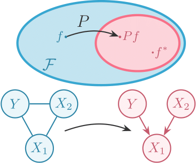

# Returning the Favour: When Regression Benefits from Probabilistic Causal Knowledge


<p align="center">
  
</p>


## Getting started

### Running code for *Simulation Example*
- Run from root directory
```bash
$ python run_mvn_experiment.py --cfg=config/runs/mvn_experiment.yaml --o=path/to/output/directory
```

### Running code for *Aerosol Radiative Forcing Example*
- Generate dataset (takes some time)
```bash
$ python generate_FaIR_data.py --cfg=config/generation/generate_FaIR.yaml --o=data/FaIR/ --val
```

- Then run from root directory
```bash
$ python run_FaIR_experiment.py --cfg=config/runs/FaIR_experiment.yaml --o=path/to/output/directory
```


## Reproducing paper results

#### *Simulation Example*

- Run experiment with multiple initialisation seeds
```bash
$ source ./repro/repro_mvn_experiment_multi_seeds.sh
```

- Run ablation study on number of training samples
```bash
$ source ./repro/repro_mvn_experiment_ntrain.sh
```

- Run ablation study on number semi-supervised samples
```bash
$ source ./repro/repro_mvn_experiment_semiprop.sh
```

- Run ablation study on number of dimensionality of X2
```bash
$ source ./repro/repro_mvn_experiment_d_X2.sh
```

- Run experiment for random forest model
> Go to `notebooks/mvn-random-forest-models.ipynb`


- Visualise scores and generate plots
> Go to `notebooks/mvn-experiments-score-analysis.ipynb`


#### *Aerosol Radiative Forcing Example*

- Run experiment with multiple initialisation seeds
```bash
$ source ./repro/repro_FaIR_experiment_multi_seeds.sh
```

- Run experiment for random forest model
> Go to `notebooks/FaIR-random-forest-models.ipynb`


- Visualise scores and generate table
> Go to `notebooks/FaIR-experiments-score-analysis.ipynb`


## Installation

Code implemented in Python 3.8.0

#### Setting up environment

Create and activate environment (with [pyenv](https://www.devopsroles.com/install-pyenv/) here)
```bash
$ pyenv virtualenv 3.8.0 venv
$ pyenv activate venv
$ (venv)
```

Install dependencies
```bash
$ (venv) pip install -r requirements.txt
```

#### References
```
@inproceedings{BouFawSej2023,
  title={{Returning The Favour: When Regression Benefits From Probabilistic Causal Knowledge}},
  author={Bouabid, Shahine and Fawkes, Jake and Sejdinovic, Dino},
  year={2023},
  journal={International Conference on Machine Learning (ICML)}
}
```
